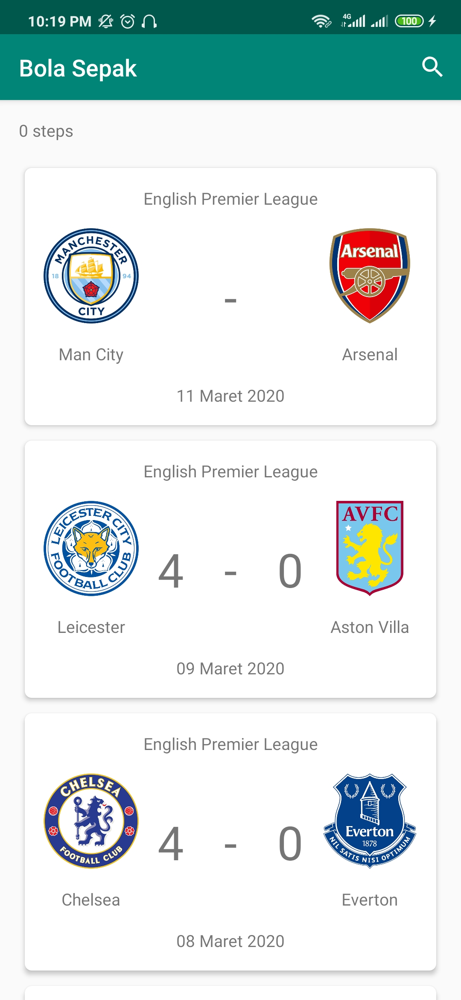
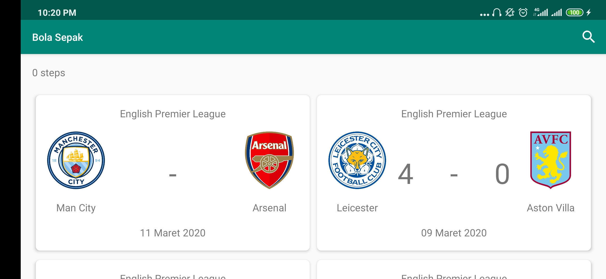
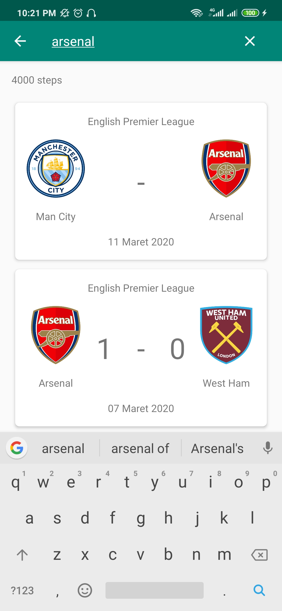
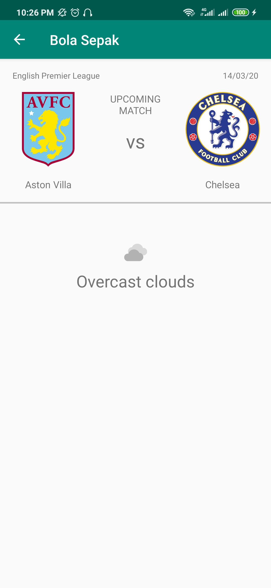
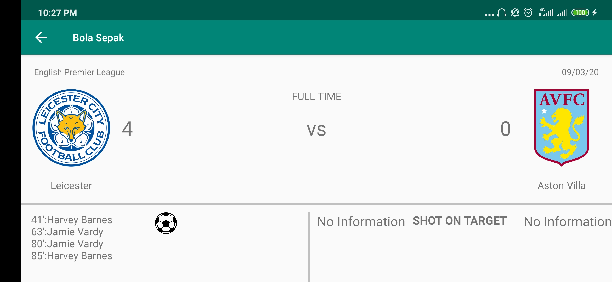
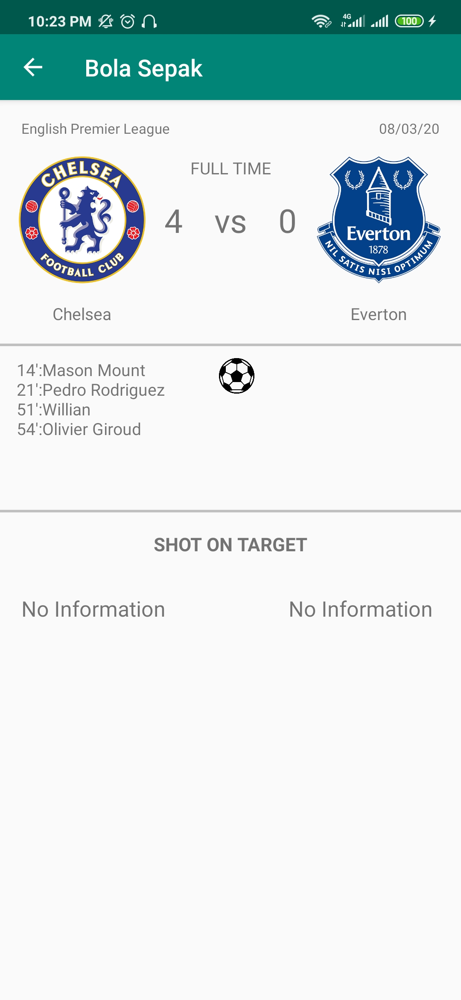
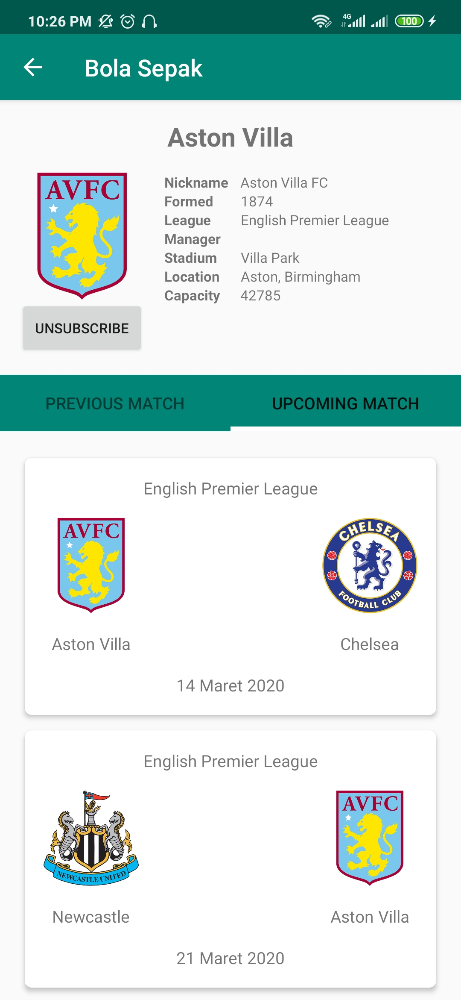
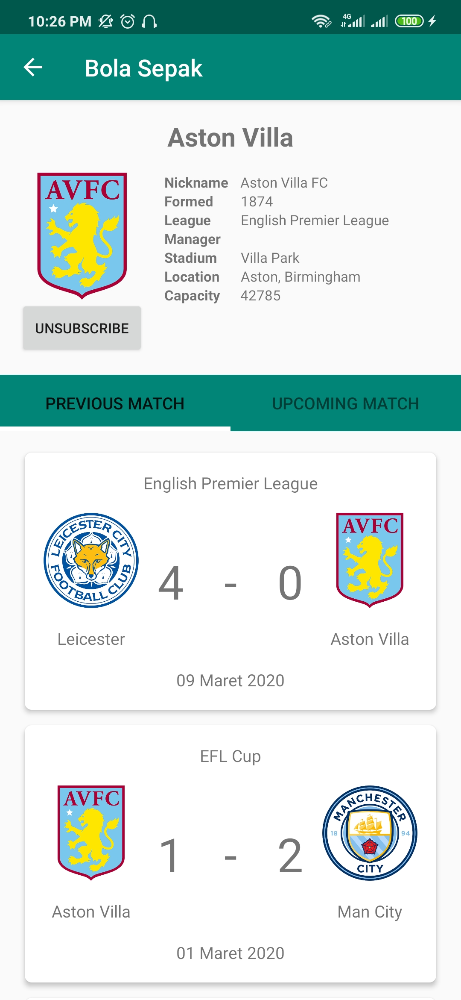

# SOCCERAPP #
Last updated 2020-04

## 1. Application Description ##

SoccerApp is an application that provides the latest information about football. The main feature of SoccerApp is that it provides information on both past and upcoming matches. In addition to the Schedule, SoccerApp will also show the location of the match and also the weather at the location of the match.

In addition to viewing the schedule, users can also view the profile of a team along with the matches they have played. Users can also ***Subscribe*** their favorite team to get notifications when that team will compete.

## 2. How It Works ##

In View Home, the application will request data from The Sport DB API. The adapter is then used to provide data and control the display of that data. The adapters will be put into the recycler view which allows to display many adapters at the same time. After fetching the data, they will be put into a local database using Room so users can still access the home menu without requiring internet connection. 

From the View Home, the User can choose to go to Match Detail by selecting the card view part of the match, or to Team Detail by pressing the logo of one of the teams. Both actions will send teamID or MatchID to each view. Both of these data will be used to request data from The Sport DB API. In Team Details, users can subscribe to their favorite team. The team information will be stored in the database to be used in the process of sending notifications if there is a match from the team concerned within one day.

For Match Detail View, in addition to requesting data from The Sport DB API, we also request data to OpenWeather to get the weather from where the two teams are competing.

## 3. Used Libraries ##

### 3.1 Retrofit ###

Retrofit makes it easier for us to handle data retrieval cases from the API. Since all the data we display comes from a specific API, there will be a lot of API usage for data retrieval. With Retrofit, we just need to provide an interface that turns the query to the API into a function. This makes it easier to read and doesn't need to be rewritten.

### 3.2 Moshi ###

The API that is used provides a large number of key-value pairs on each call. But not all of our data is used. We use Moshi to determine which keys we need and convert them into a Java Object.

### 3.3 Picasso ###

Since all the images we need to display are in the form of a URL, Picasso is used to display those images. Picasso allows hassle-free image loading in the app, which is often in only one line of code, so writing long codes aren't needed to display the image. Many of the issues of image loading on Android are also handled by Picasso, such as handling ImageView recycling and download cancellation in an adapter, complex image transformations with minimal memory use, and automatic memory and disk caching.

### 3.4 Room ###

This library is used to access SQLite. Room has features to create databases, perform queries, and how to run those queries into separate classes. The use of Room makes it easy for us to *manage* the use of our Database and Query.
In Room, there are three major components, namely, the database class which holds the database and serves as the main access point for the underlying connection to the app's persisted data, data entities which represent tables , and Data Access Objects (DAO) which provide methods to query, update, insert and delete data in the database. The database class provides the app with instances of DAOs associated with that database. The App can use the DAOs to retrieve data from the database as instances of the associated DAOs. The app can also use the defined data entities to update rows from the corresponding tables, or to create new rows for insertion.

### 3.5 Androidx.work ###

This Worker Thread is used to run notification delivery. The app needs a library that allows us to send requests every certain time interval. Because in order to send notifications, The date today needs to be compared with the time of the next match of the team that the user has *subscribed*. The app sends a notification for each match where at least one team has been *subscribed* by the user exists the next day.

### 3.6 Card View ###

This library is used to design the UI appearance so that it is much more attractive

## 4.App Screenshot ##

1. Home Menu

    

    

    
2. Match Detail
    

    

    

    
3. Team Detail
    

    

    

    